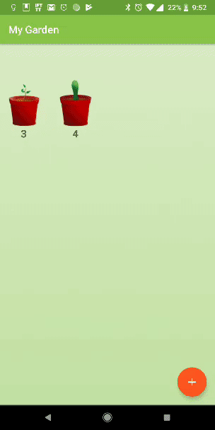

# Exercise 1 - Add New Widget

## _plant_widget_info.xml_
#### 1. Create a `plant_widget_info.xml` file and set `updatePeriodMillis` to 30 minutes. [[code][1]]
```xml
<appwidget-provider xmlns:android="http://schemas.android.com/apk/res/android"
    android:initialLayout="@layout/plant_widget"
    android:minHeight="40dp"
    android:minWidth="40dp"
    android:previewImage="@drawable/launcher_icon"
    android:resizeMode="horizontal|vertical"
    android:updatePeriodMillis="1800000"
    android:widgetCategory="home_screen" />
```


## _plant_widget.xml_
#### 2. Create a `plant_widget.xml` file that contains an `ImageView` defaulting to `@drawable/grass`. [[code][2]]
```xml
    <ImageView
        android:id="@+id/widget_plant_image"
        android:layout_width="wrap_content"
        android:layout_height="wrap_content"
        android:layout_gravity="center"
        android:src="@drawable/grass" />
```


## PlantWidgetProvider.java
#### 3. Create a `PlantWidgetProvider` class that extends `AppWidgetProvider` and set `updateAppWidget` to handle clicks and launch `MainActivity`. [[code][3]]
```java
public class PlantWidgetProvider extends AppWidgetProvider {


    static void updateAppWidget(Context context, AppWidgetManager appWidgetManager, int appWidgetId) {


        // Create an Intent to launch MainActivity when clicked
        Intent intent = new Intent(context, MainActivity.class);
        PendingIntent pendingIntent = PendingIntent.getActivity(context, 0, intent, 0);
        // Construct the RemoteViews object
        RemoteViews views = new RemoteViews(context.getPackageName(), R.layout.plant_widget);
        // Widgets allow click handlers to only launch pending intents
        views.setOnClickPendingIntent(R.id.widget_plant_image, pendingIntent);
        // Instruct the widget manager to update the widget
        appWidgetManager.updateAppWidget(appWidgetId, views);
    }


    @Override
    public void onUpdate(Context context, AppWidgetManager appWidgetManager, int[] appWidgetIds) {
        // There may be multiple widgets active, so update all of them
        for (int appWidgetId : appWidgetIds) {
            updateAppWidget(context, appWidgetManager, appWidgetId);
        }
    }
```


## AndroidManifest.xml
#### 4. Add a receiver tag for `PlantWidgetProvider` and an `intent-filter` for `APPWIDGET_UPDATE` with meta data pointing to the `plant_widget_info` file. [[code][4]]
```xml
        <receiver android:name=".PlantWidgetProvider">
            <intent-filter>
                <action android:name="android.appwidget.action.APPWIDGET_UPDATE" />
            </intent-filter>


            <meta-data
                android:name="android.appwidget.provider"
                android:resource="@xml/plant_widget_info" />
        </receiver>
        <receiver android:name=".PlantWidgetProvider">
            <intent-filter>
                <action android:name="android.appwidget.action.APPWIDGET_UPDATE" />
            </intent-filter>


            <meta-data
                android:name="android.appwidget.provider"
                android:resource="@xml/plant_widget_info" />
        </receiver>
```

## _Class Reference_
### [RemoteViews](https://developer.android.com/reference/android/widget/RemoteViews.html)

|Return Type | Method Name |
|--------|-------------------------------------------------------------------------------------------------------------------------------------------------------------------------------------------------------------------------------------------------------------------------------------------------------------------------------------------------------------------------------------------------------------------------------------------------------------------------------------------------------------------------------------------------------------------------------------------------------|
| `void` | [setOnClickPendingIntent](https://developer.android.com/reference/android/widget/RemoteViews.html#setOnClickPendingIntent)`(int viewId,` [PendingIntent](https://developer.android.com/reference/android/app/PendingIntent.html) `pendingIntent)` <br/>Equivalent to calling [setOnClickListener(android.view.View.OnClickListener)](https://developer.android.com/reference/android/view/View.html#setOnClickListener(android.view.View.OnClickListener)) to launch the provided [PendingIntent](https://developer.android.com/reference/android/app/PendingIntent.html). |


### [AppWidgetManager](https://developer.android.com/reference/android/appwidget/AppWidgetManager.html)
|Return Type | Method Name |
|--------|----------------------------------------------------------------------------------------------------------------------------------------------------------------------------------------------------------------------------------------------------------------------------------------------------------------------------------|
| `void` | [updateAppWidget](https://developer.android.com/reference/android/appwidget/AppWidgetManager.html#updateAppWidget)`(int appWidgetId,` [RemoteViews](https://developer.android.com/reference/android/widget/RemoteViews.html) `views)` <br/>Set the RemoteViews to use for the specified appWidgetId. |


### [AppWidgetProvider](https://developer.android.com/reference/android/appwidget/AppWidgetProvider.html)
|Return Type | Method Name |
|--------|---------------------------------------------------------------------------------------------------------------------------------------------------------------------------------------------------------------------------------------------------------------------------------------------------------------------------------------------------------------------------------------------------------------------------------------------------------------------------------------------------------------------------------------------------------------|
| `void` | [onDeleted](https://developer.android.com/reference/android/appwidget/AppWidgetProvider.html#onDeleted)`(`[Context](https://developer.android.com/reference/android/content/Context.html) `context, int[] appWidgetIds)` <br/>Called in response to the [ACTION_APPWIDGET_DELETED](https://developer.android.com/reference/android/appwidget/AppWidgetManager.html#ACTION_APPWIDGET_DELETED) broadcast when one or more AppWidget instances have been deleted. Override this method to implement your own AppWidget functionality. |
| `void` | [onDisabled](https://developer.android.com/reference/android/appwidget/AppWidgetProvider.html#onDisabled(android.content.Context))`(`[Context](https://developer.android.com/reference/android/content/Context.html) `context)` <br/>Called in response to the [ACTION_APPWIDGET_DISABLED](https://developer.android.com/reference/android/appwidget/AppWidgetManager.html#ACTION_APPWIDGET_DISABLED) broadcast, which is sent when the last AppWidget instance for this provider is deleted. Override this method to implement your own AppWidget functionality.  |
| `void` | [onEnabled](https://developer.android.com/reference/android/appwidget/AppWidgetProvider.html#onEnabled(android.content.Context))`(`[Context](https://developer.android.com/reference/android/content/Context.html) `context)` <br/>Called in response to the [ACTION_APPWIDGET_ENABLED](https://developer.android.com/reference/android/appwidget/AppWidgetManager.html#ACTION_APPWIDGET_ENABLED) broadcast when the a AppWidget for this provider is instantiated. Override this method to implement your own AppWidget functionality.                            |
| `void` | [onUpdate](https://developer.android.com/reference/android/appwidget/AppWidgetProvider.html#onUpdate)`(`[Context](https://developer.android.com/reference/android/content/Context.html) `context,` [AppWidgetManager](https://developer.android.com/reference/android/appwidget/AppWidgetManager.html) `appWidgetManager, int[] appWidgetIds)` <br/>Called in response to the [ACTION_APPWIDGET_UPDATE](https://developer.android.com/reference/android/appwidget/AppWidgetManager.html#ACTION_APPWIDGET_UPDATE) and [ACTION_APPWIDGET_RESTORED](https://developer.android.com/reference/android/appwidget/AppWidgetManager.html#ACTION_APPWIDGET_RESTORED) broadcasts when this AppWidget provider is being asked to provide [RemoteViews](https://developer.android.com/reference/android/widget/RemoteViews.html) for a set of AppWidgets. Override this method to implement your own AppWidget functionality. |

## _Screenshots_


[1]: https://github.com/aaroncrutchfield/AdvancedAndroid_MyGarden/blob/5deeb7f2e5aa39c3c758148dbb9178321d779473/app/src/main/res/xml/plant_widget_info.xml#L3-L10
[2]: https://github.com/aaroncrutchfield/AdvancedAndroid_MyGarden/blob/5deeb7f2e5aa39c3c758148dbb9178321d779473/app/src/main/res/layout/plant_widget.xml#L7-L12
[3]: https://github.com/aaroncrutchfield/AdvancedAndroid_MyGarden/blob/5deeb7f2e5aa39c3c758148dbb9178321d779473/app/src/main/java/com/example/android/mygarden/PlantWidgetProvider.java#L16-L37
[4]: https://github.com/aaroncrutchfield/AdvancedAndroid_MyGarden/blob/deff33d2c7a7bf49b2649f23627985026020c32b/app/src/main/AndroidManifest.xml#L33-L50